# KI Agenten, unbesiegbare Teilnehmer bei einem Hackathon?

<div class="pt-12">
  <span @click="$slidev.nav.next" class="px-2 py-1 rounded cursor-pointer" hover="bg-white bg-opacity-10">
    Press Space für die Zukunft des Codings <carbon:arrow-right class="inline"/>
  </span>
</div>

<div class="abs-br m-6 flex gap-2">
  <button @click="$slidev.nav.openInEditor()" title="Open in Editor" class="text-xl slidev-icon-btn opacity-50 !border-none !hover:text-white">
    <carbon:edit />
  </button>
  <a href="https://github.com" target="_blank" alt="GitHub" title="Open in GitHub"
    class="text-xl slidev-icon-btn opacity-50 !border-none !hover:text-white">
    <carbon-logo-github />
  </a>
</div>

<!--
Willkommen zur Präsentation über KI-Agenten bei Hackathons!
Heute zeige ich euch, wie ihr in 24 Stunden von der Idee zur funktionierenden App kommt.
-->

---
transition: fade-out
layout: intro
---

# Die Challenge

<div class="text-4xl font-bold animate-pulse">
24 Stunden. Eine Idee. Ein funktionierendes Produkt.
</div>

<br>

<div v-click class="text-2xl text-gray-400">
Wie KI-Agenten das Spiel verändern...
</div>

<div v-click class="absolute bottom-20 right-20">
  
</div>

<style>
h1 {
  background-color: #2B90B6;
  background-image: linear-gradient(45deg, #4EC5D4 10%, #146b8c 20%);
  background-size: 100%;
  -webkit-background-clip: text;
  -moz-background-clip: text;
  -webkit-text-fill-color: transparent;
  -moz-text-fill-color: transparent;
}
</style>

---
layout: default
---

# Agenda

<div class="grid grid-cols-2 gap-8 pt-4">

<div>

## Teil 1: Foundation 🏗️
<v-clicks>

- **Geschichte**: Von ELIZA zu GPT-4
- **Status Quo**: Die Tool-Landschaft 2025
- **Vibe Coding**: Das neue Paradigma

</v-clicks>
</div>

<div>

## Teil 2: Action 🚀
<v-clicks>

- **Hackathon-Reality**: Mit vs. Ohne KI
- **Hands-On**: Der perfekte Workflow
- **Future**: Was kommt als nächstes?

</v-clicks>
</div>

</div>

---
transition: slide-up
---

# Von ELIZA zu KI-Agenten

<div class="grid grid-cols-3 gap-4 pt-8">
  <div v-click class="bg-blue-500 bg-opacity-20 p-6 rounded-lg">
    <div class="text-3xl mb-2">1966</div>
    <h3 class="text-xl font-bold mb-2">ELIZA</h3>
    <p class="text-sm">Erster Chatbot am MIT</p>
  </div>

  <div v-click class="bg-green-500 bg-opacity-20 p-6 rounded-lg">
    <div class="text-3xl mb-2">2022</div>
    <h3 class="text-xl font-bold mb-2">ChatGPT</h3>
    <p class="text-sm">100M Nutzer in 2 Monaten</p>
  </div>

  <div v-click class="bg-purple-500 bg-opacity-20 p-6 rounded-lg">
    <div class="text-3xl mb-2">2025</div>
    <h3 class="text-xl font-bold mb-2">KI-Agenten</h3>
    <p class="text-sm">Autonome Entwickler</p>
  </div>
</div>

<div v-click class="mt-8 text-center text-2xl font-bold">
  76% der Entwickler nutzen bereits KI-Tools
  <div class="text-sm text-gray-400 mt-2">Stack Overflow Survey 2024</div>
</div>

---
layout: quote
---

# "Vibe Coding"
> "Fully giving in to the vibes, embracing exponentials"

<div class="mt-8 text-right text-gray-400">
  - Andrej Karpathy, Februar 2025
</div>

<v-click>

<div class="mt-12 text-center">
  <div class="text-2xl">Y Combinator Winter 2025:</div>
  <div class="text-4xl font-bold text-green-400">25% der Startups</div>
  <div class="text-xl">haben 95% KI-generierten Code</div>
</div>

</v-click>

<v-click>
<div class="absolute top-20 right-10 transform rotate-12">
  <div class="bg-gray-900 p-2 rounded-lg shadow-2xl border-2 border-gray-700">
    <div class="flex">
      <div class="w-32">
        <div class="h-20 bg-red-600 flex items-center justify-center border-b-2 border-gray-700">
          <div class="text-5xl">❌</div>
        </div>
        <div class="h-20 bg-green-600 flex items-center justify-center">
          <div class="text-5xl">✅</div>
        </div>
      </div>
      <div class="w-48">
        <div class="h-20 flex items-center p-3 border-b-2 border-gray-700 bg-gray-800">
          <div class="text-sm font-bold text-white">Code manuell schreiben</div>
        </div>
        <div class="h-20 flex items-center p-3 bg-gray-800">
          <div class="text-sm font-bold text-white">Vibe Coding mit KI 🚀</div>
        </div>
      </div>
    </div>
  </div>
</div>
</v-click>

---
layout: two-cols
---

<template v-slot:default>

# Die Tool-Revolution 2025

## IDE-basierte Assistenten

<v-clicks depth="2">

- **GitHub Copilot**
  - 15M+ Nutzer
  - Multi-Model Support
  - $10/Monat

- **Amazon Q Developer**
  - AWS-Integration
  - Kostenlose Stufe

</v-clicks>

</template>

<template v-slot:right>

<div class="ml-4">

## KI-native IDEs

<v-clicks depth="2">

- **Cursor**
  - Agent Mode
  - $20/Monat

- **Windsurf**
  - Cascade-Tech
  - $15/Monat

</v-clicks>

</div>

</template>

---
layout: center
class: text-center
---

# Web-basierte Game Changer

<div class="grid grid-cols-3 gap-8 mt-8">
  <div v-click class="relative group">
    <div class="absolute -inset-2 bg-gradient-to-r from-purple-600 to-pink-600 rounded-lg blur opacity-25 group-hover:opacity-75 transition duration-300"></div>
    <div class="relative bg-gray-900 p-6 rounded-lg">
      <logos-stackblitz-icon class="text-8xl mx-auto mb-4"/>
      <h3 class="text-2xl font-bold">bolt.new</h3>
      <p class="text-gray-400">$20M ARR in 2 Monaten</p>
      <div class="text-xs mt-2 text-green-400">🚀 Speedrun champion</div>
    </div>
  </div>

  <div v-click class="relative group">
    <div class="absolute -inset-2 bg-gradient-to-r from-blue-600 to-cyan-600 rounded-lg blur opacity-25 group-hover:opacity-75 transition duration-300"></div>
    <div class="relative bg-gray-900 p-6 rounded-lg">
      <logos-vercel-icon class="text-8xl mx-auto mb-4"/>
      <h3 class="text-2xl font-bold">v0</h3>
      <p class="text-gray-400">UI aus Text/Bildern</p>
      <div class="text-xs mt-2 text-blue-400">🎨 Design wizard</div>
    </div>
  </div>

  <div v-click class="relative group">
    <div class="absolute -inset-2 bg-gradient-to-r from-green-600 to-emerald-600 rounded-lg blur opacity-25 group-hover:opacity-75 transition duration-300"></div>
    <div class="relative bg-gray-900 p-6 rounded-lg">
      <mdi-robot class="text-8xl mx-auto mb-4 text-blue-400"/>
      <h3 class="text-2xl font-bold">Replit Agent</h3>
      <p class="text-gray-400">Autonomer Entwickler</p>
      <div class="text-xs mt-2 text-emerald-400">🤖 Your coding buddy</div>
    </div>
  </div>
</div>

---

# Command-Line Power Tools

<div class="grid grid-cols-2 gap-8">

<div v-click>

## Claude Code
```bash
# Terminal-native KI-Assistenz
claude-code "Refactor this codebase"

# Sub-Agent-Orchestrierung
claude-code --think-harder "Complex problem"
```

</div>

<div v-click>

## Gemini CLI (Kostenlos!)
```bash
# 60 Anfragen/Minute, 1000/Tag
gemini "Design architecture for hackathon project"

# 1 Million Token Kontext
gemini --file sketch.pdf "Convert to React app"
```

</div>

</div>

<div v-click class="mt-8 p-4 bg-green-500 bg-opacity-20 rounded-lg text-center">
  <carbon-star class="inline text-2xl"/> <strong>Pro-Tipp:</strong> Gemini CLI ist komplett kostenlos und perfekt für Hackathons!
</div>

---
transition: slide-left
---

# Microsoft AI Agents Hackathon 2025

<div class="grid grid-cols-2 gap-8">

<div>

## Die Zahlen
- <span class="text-4xl font-bold text-blue-400">18.000+</span> Entwickler
- <span class="text-4xl font-bold text-green-400">570</span> Einreichungen
- <span class="text-4xl font-bold text-purple-400">12</span> Länder

</div>

<div v-click>

## Die Gewinner

**🏆 RiskWise**
- Supply-Chain-Risikoanalyse
- Multi-Agent-System

**🥈 Apollo**
- Meta-Agent für Deep Research
- Selbstreflektives RAG

</div>

</div>

---
layout: fact
---

# 12 Stunden
<div class="text-2xl">Zeit gespart für Innovation und Polish!</div>

<v-click>

<div class="absolute bottom-10 left-0 right-0">
  <div class="text-center text-gray-400">Mit KI-Agenten vs. Traditioneller Ansatz</div>
</div>

</v-click>

<v-click>
<div class="absolute top-10 right-10">
  
</div>
</v-click>

---

# Der Hackathon-Workflow

<div class="relative">


<div v-click class="mt-8 grid grid-cols-3 gap-4">
  <div class="bg-blue-500 bg-opacity-20 p-4 rounded">
    <h3 class="font-bold">Setup Phase</h3>
    <code class="text-sm">task-master parse-prd idea.txt</code>
  </div>

  <div class="bg-green-500 bg-opacity-20 p-4 rounded">
    <h3 class="font-bold">Development</h3>
    <code class="text-sm">cursor + windsurf + copilot</code>
  </div>

  <div class="bg-purple-500 bg-opacity-20 p-4 rounded">
    <h3 class="font-bold">Deployment</h3>
    <code class="text-sm">bolt.new → production</code>
  </div>
</div>

</div>

---

# Context > Prompt Engineering

<div class="text-center text-lg mb-6">
  <span class="text-gray-400">2023: "Prompts"</span> → <span class="text-green-400 font-bold">2025: "Context"</span>
</div>

<div class="grid grid-cols-2 gap-8">

<div>

<v-clicks>

**🎯 Was zählt:**
- Zeitdruck (T-18h)
- Tech Stack definiert
- Team & Skills klar
- Constraints bekannt

</v-clicks>

</div>

<div v-click>

```markdown
HACKATHON CONTEXT:
Zeit: T-18h | Team: 4
Stack: React, Supabase

TASK: "OAuth Login"

GEGEBEN:
- User Model exists
- Auth middleware ready
```

</div>

</div>

<div v-click class="text-center mt-6 text-sm text-purple-400 font-bold">
✨ Mehr Kontext = Besserer Output = Weniger Rework
</div>

---
layout: center
---

# Multi-Tool-Orchestrierung

```mermaid {theme: 'dark', scale: 0.5}
graph LR
    A[💡] --> B[🤖]
    B --> C[🎨] 
    C --> D[⚡]
    D --> E[🚀]
    
    style A fill:#f9f
    style E fill:#9f9
```

<div class="grid grid-cols-2 gap-8 mt-8">

<div>



<div class="text-sm mt-4 text-gray-400">
Idee → KI → UI → Code → Deploy
</div>

</div>

<div>

## Der Stack

<v-clicks>

- **🤖 Planung**: ChatGPT
- **🎨 UI**: v0  
- **⚡ Code**: Cursor
- **🚀 Deploy**: Auto

</v-clicks>

</div>

</div>

---
transition: fade
---

# Live Demo: 0 → App in 15 Min

<div class="flex items-center justify-center h-full relative">
  <div class="text-center">
    <mdi-play-circle class="text-8xl text-green-400 animate-pulse"/>
    <div class="text-2xl mt-4">Bereit für die Live-Demo?</div>
    <div class="text-gray-400 mt-2">Von der Idee zur funktionierenden App</div>
  </div>
  
  <div v-click class="absolute -bottom-10 left-1/2 transform -translate-x-1/2">
    
    <div class="text-center mt-2 font-mono text-green-400">./deploy --speed=ludicrous</div>
  </div>
</div>

---
layout: center
---

# Die Zukunft: 2025 und darüber hinaus

<div class="grid grid-cols-2 gap-12 mt-8">

<div v-click>

## Aktuelle Entwicklungen
- OpenAI "Operator" (Q1 2025)
- GitHub Copilot Async Mode
- Google Agent Dev Kit

</div>

<div v-click>

## Neue Paradigmen
- Multi-Agent-Systeme
- Voice-Controlled Coding
- AR/VR Code-Spaces

</div>

</div>

<v-click>

<div class="mt-12 text-center text-2xl">
  <span class="text-green-400 font-bold">91.5%</span> Pass-Rate bei Coding-Benchmarks
  <div class="text-sm text-gray-400">AgentCoder Performance</div>
</div>

</v-click>

---

# Der Gewinner-Stack für Hackathons

<div class="grid grid-cols-2 gap-8">

<div>

## 🆓 Kostenlos-Stack
```yaml
Planning: Gemini CLI
Development: GitHub Copilot (Studenten)
UI: v0 Free Tier (200 Credits)
Backend: Supabase
Deployment: Vercel/Netlify
```

<div class="mt-4 text-green-400">
  💰 Total: 0€/Monat
</div>

</div>

<div v-click>

## 🚀 Premium-Stack
```yaml
Planning: Claude Code
Development: Cursor Pro
Assistance: GitHub Copilot
UI: v0 Pro
Testing: AI Test Suite
```

<div class="mt-4 text-yellow-400">
  💰 Total: ~50€/Monat
</div>

</div>

</div>

<v-click>

<div class="mt-8 p-4 bg-blue-500 bg-opacity-20 rounded text-center">
  <strong>ROI:</strong> Ein gewonnener Hackathon = unbezahlbar 🏆
</div>

</v-click>

---

# Praktische Tipps für Erfolg

<div class="grid grid-cols-2 gap-8">

<div>

## ✅ Do's

<v-clicks>

- **Fokus auf MVP** - KI verführt zu Features
- **Verstehe den Code** - Debugging ist wichtig
- **Tool-Mastery** - 2-3 Tools perfekt > 10 oberflächlich
- **Dokumentiere KI-Nutzung** - Transparenz

</v-clicks>

<div v-click class="mt-4">
  
  <div class="text-xs text-center mt-2 text-gray-400">When your code works first try</div>
</div>

</div>

<div>

## ❌ Don'ts

<v-clicks>

- **Blind Copy-Paste** - Verstehe was du tust
- **Feature Creep** - Zeit ist begrenzt
- **Tool-Overload** - Bleib beim Stack
- **KI als Ausrede** - Du bist der Entwickler

</v-clicks>

<div v-click class="mt-4">
  
  <div class="text-xs text-center mt-2 text-gray-400">"Die KI hat's geschrieben!" - "Du bist verantwortlich!"</div>
</div>

</div>

</div>

---
layout: quote
---

# "KI-Agenten sind Werkzeuge, keine Gegner"

<div class="mt-8 text-xl">
Sie verstärken eure Kreativität - sie ersetzen sie nicht.
</div>

---
layout: center
---

# Call to Action 🚀

<div class="text-2xl space-y-4">

<v-clicks>

<div>
  <carbon-checkbox-checked class="text-green-400"/> Teste **einen** neuen KI-Agent heute
</div>

<div>
  <carbon-checkbox-checked class="text-green-400"/> Bilde Teams mit komplementären KI-Skills
</div>

<div>
  <carbon-checkbox-checked class="text-green-400"/> Dokumentiere eure Erfahrungen
</div>

</v-clicks>

</div>

<v-click>

<div class="mt-12 text-gray-400">
  Die Zukunft wartet nicht - fang heute an!
</div>

</v-click>

---
layout: end
---

# Danke! 🎉

<div class="text-2xl mt-8">
  Fragen? Diskussion? Let's hack!
</div>

<div class="mt-12 space-y-2 text-gray-400">
  <div><carbon-logo-github class="inline"/> github.com/your-repo/ai-agents-hackathon</div>
  <div><carbon-logo-discord class="inline"/> discord.gg/ai-agents-community</div>
  <div><carbon-email class="inline"/> contact@ai-hackathon.dev</div>
</div>

<style>
h1 {
  background-color: #4EC5D4;
  background-image: linear-gradient(45deg, #4EC5D4 10%, #146b8c 20%);
  background-size: 100%;
  -webkit-background-clip: text;
  -moz-background-clip: text;
  -webkit-text-fill-color: transparent;
  -moz-text-fill-color: transparent;
}
</style>
